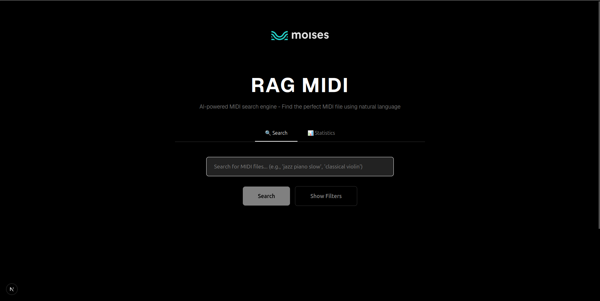

# 🎵 RAG-MIDI: Search & Discover

Sistema de busca semântica para arquivos MIDI usando Retrieval-Augmented Generation (RAG).



## 📁 Estrutura do Projeto

```
RAG-midi/
├── backend/                 # Sistema RAG em Python
│   ├── src/
│   │   ├── rag_engine.py           # Motor de busca RAG
│   │   ├── metadata_processor.py   # Processamento de metadados
│   │   ├── config.py              # Configurações
│   │   └── streamlit_app.py       # Interface Streamlit
│   ├── requirements.txt           # Dependências Python
│   └── run_rag_midi.py           # Script principal
├── frontend/                # Interface Next.js
│   ├── src/                # Código fonte React/Next.js
│   └── package.json
├── data/                  # Dados e índices
│   ├── index/            # Índices FAISS
│   ├── midi/             # Arquivos MIDI
│   └── metadata/         # Metadados dos datasets
├── docs/                 # Documentação
├── scripts/              # Scripts utilitários
└── run.py               # Gerenciador do projeto
```

## 🚀 Início Rápido

### 1. Configuração Inicial
```bash
python run.py --setup
```

### 2. Executar apenas o Backend (Streamlit)
```bash
python run.py --backend
```

### 3. Executar apenas o Frontend (Next.js)
```bash
python run.py --frontend
```

### 4. Executar Stack Completo
```bash
python run.py --fullstack
```

## 📊 Datasets Suportados

- **ComMU**: 11,144 arquivos MIDI
- **LMD Full/MidiCaps**: 168,385 arquivos MIDI  
- **E-GMD**: 45,537 arquivos MIDI
- **Total**: 225,066+ arquivos indexados

## 🔧 Comandos Úteis

```bash
# Testar sistema RAG
python run.py --test

# Reconstruir índice FAISS
python run.py --build-index
```

## 🌐 APIs e Endpoints

### Backend (Streamlit) - Porto 8501
- Interface web completa
- API de busca semântica
- Download de arquivos MIDI

### Frontend (Next.js) - Porto 3000
- Interface moderna React
- Integração com APIs do backend
- Deploy otimizado para Vercel

## 📈 Performance

- **Tempo de indexação**: ~15 minutos para 225K arquivos
- **Tempo de busca**: <1 segundo para queries complexas
- **Tamanho do índice**: ~2.5GB FAISS + metadados

## 🔍 Busca Semântica

Exemplos de queries suportadas:
- "romantic piano ballad in minor key"
- "energetic jazz with saxophone"
- "classical music with strings and piano"
- "electronic dance music 120 BPM"

## 🎯 Para Moises/Music.ai

Sistema configurado para:
- URLs de bucket em produção
- Escalabilidade horizontal
- Integração com storage em nuvem

## 📝 Licença

MIT License - veja arquivo LICENSE para detalhes.
